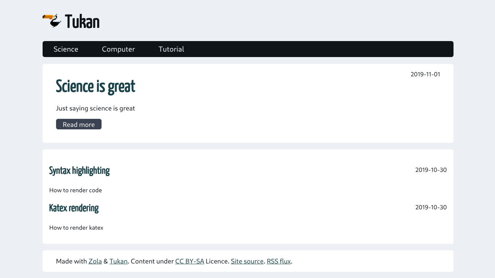

# Tukan

A light theme for Zola adapted from Pelican.




## Installation

You can add the theme as a submodule :

```bash
git submodule add --name tukan https://codeberg.org/salif/tukan.git themes/tukan
```

and enable the theme in your `config.toml`

```toml
theme = "tukan"
```

## Usage

Categories will be added to the menu, and all articles from categories with

```toml
transparent = true
```

will be listed in the home page.

You can personalize the following options :

```toml
[extra]
title = "Tukan theme"
title_pic = "$BASE_URL/favicon.ico"
description = "Theme for Zola inspired from Pelican website theme"
license = """Content under <a href="https://creativecommons.org/licenses/by-sa/4.0/">CC BY-SA</a> Licence"""
```
